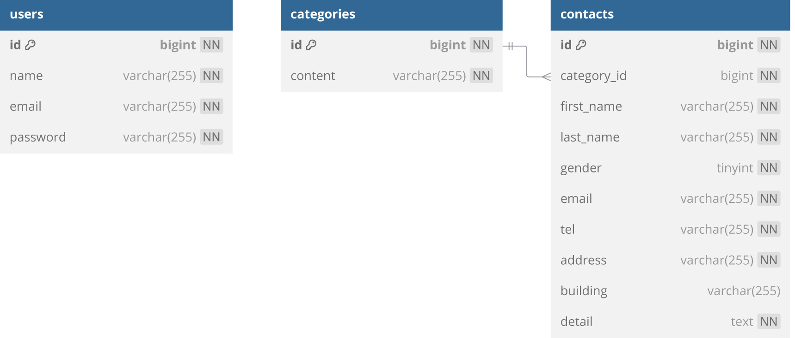

# お問合せフォーム

## 環境構築

### Docker ビルド

1. git clone https://github.com/kie-okamoto/contact-formtest.git

2. docker-compose up -d --build

※ MySQL は OS によって起動しない場合があるので、必要に応じて docker-compose.yml を編集してください。

### Laravel 環境構築

1. docker-compose exec php bash
2. composer install
3. `.env` ファイルを作成  
   以下のコマンドを実行して `.env.example` から `.env` をコピーします：  
   `cp .env.example .env`

4. php artisan key:generate
5. php artisan migrate
6. php artisan db:seed

## 使用技術

- PHP 7.4.9
- Laravel 8.83.8
- MySQL 8.0.26

## ER 図

## URL

- 開発環境: http://localhost/
- phpMyAdmin: http://localhost:8080/
